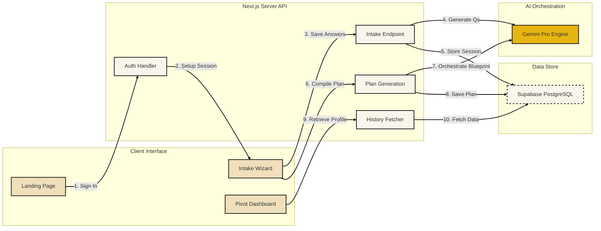

# Runway360

Next-generation career transition coach and financial runway simulator designed for managing career pivots with mathematical precision and AI-driven guidance.

```
       [ Intake Coach ] ---> [ Sandbox Calibrator ] ---> [ Action Plan ]
     10-Step AI Interview    Real-time Survial Budget     Checklists & Timeline
```

---

## System Flow & Architecture

This diagram illustrates the data flow from the Gen Z Neobrutalist Client interface down to the AI model orchestration and database persistence layers.



---

## Core Capabilities

### Intake & Coach
* **Conversational Intake**: Low-friction 10-step interview analyzing current role, savings, expenses, timeframe, and goals.
* **Adaptive Prompts**: Generates dynamic follow-up questions via Gemini AI to probe specific skill gaps and commitments.

### Sandbox Simulation
* **Savings Runway**: Instant calculation of cost-survival runway months based on input metrics.
* **Emergency Buffer**: Visualizes budget shortfalls and checks savings against standard 6-month safety guidelines.
* **Transition Target**: Reality checks your timeline and rates it as realistic, optimistic, or underfunded.

### Dashboard Output
* **Task Blueprints**: Spawns actionable phase checklists (Days 1-30, 31-60, 61-90) saved persistently.
* **Journey Mapping**: Charts psychological transition phases (honeymoon, adjustment, integration) and tips.

---

## Project Structure

```
├── .github/workflows/   # Automated CI checks (Lint, TypeScript, Vitest)
├── public/              # Metadata base assets (og_image, robots, sitemaps, llms.txt)
├── src/
│   ├── __tests__/       # Calculations & component unit test suites
│   ├── app/             # Page layouts, dynamic routes, and backend API handlers
│   ├── components/      # Modular UI views (LandingHero, InteractiveSandbox)
│   └── lib/             # Calculations, failover LLM router, and database configs
├── README.md            # System documentation
├── vitest.config.ts     # Vitest environment setup
└── package.json         # Scripts and package manifests
```

---

## Core Technology Stack

| Component | Technology | Description |
| :--- | :--- | :--- |
| **Framework** | Next.js 16 (App Router) | React server components and dynamic API route handlers |
| **Database** | Supabase | PostgreSQL storage for session answers and plan blueprints |
| **Auth** | NextAuth.js | Google OAuth sign-in integrations |
| **Animation** | HTML5 Canvas | Smooth, interactive dot grid particle background |
| **Scroll** | Lenis | Fluid momentum-based viewport scrolling |
| **Testing** | Vitest | Fast unit and React component validation suite |

---

## Quick Start Configuration

To run the application locally, create a `.env.local` file in the root folder with these keys:

```env
NEXTAUTH_URL=http://localhost:3000
NEXTAUTH_SECRET=your-nextauth-secret-key

GOOGLE_CLIENT_ID=your-google-client-id
GOOGLE_CLIENT_SECRET=your-google-client-secret

NEXT_PUBLIC_SUPABASE_URL=your-supabase-url
NEXT_PUBLIC_SUPABASE_ANON_KEY=your-supabase-anon-key
SUPABASE_SERVICE_ROLE_KEY=your-supabase-service-role-key

GEMINI_API_KEY=your-gemini-api-key
```

### Installation Commands

```bash
# 1. Install dependencies
npm install

# 2. Run local server
npm run dev

# 3. Compile code for production
npm run build
```

---

## Quality Control & Testing

```bash
# Execute Vitest suite locally
npm run test

# Run single-run tests for CI
npm run test:ci

# Run ESLint validation
npm run lint
```
